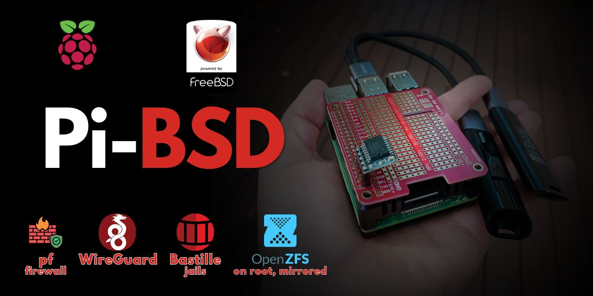

# pi-bsd

FreeBSD on Raspberry Pi 3/4 with ZFS on root, optional ZFS mirror, and more...

## Essential

- [Installation](./installation.md)

## Bonus

- [Encrypted ZFS home](./ZFS/ZFS.md)
- [WireGuard](./WireGuard/WireGuard.md)
- [bastille jails](./bastille/bastille.md)
- [pf firewall](./pf/pf.md)
- [RTC](./RTC/RTC.md)
- [Neo4j](./Neo4j/Neo4j.md)
